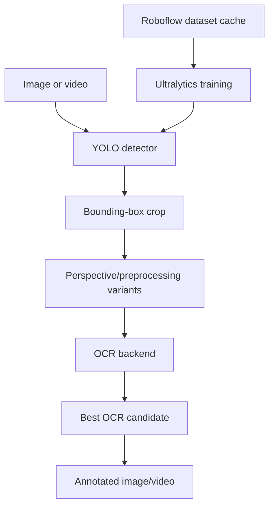

# Architecture and Implementation

## System boundary

The project is a Python 3.12 package with a CLI and a training script. It does not commit model weights or datasets.



## Module responsibilities

| Module | Responsibility |
|---|---|
| `src/lpr/detector.py` | YOLO adapter, detection bounds, crop delegation. |
| `src/lpr/preprocessing.py` | Quad ordering, rectification, crop padding, resize, grayscale and threshold variants. |
| `src/lpr/ocr.py` | OCR backend adapters and candidate scoring. |
| `src/lpr/pipeline.py` | Image/video orchestration, annotation, resource guards, and frame limits. |
| `src/lpr/metrics.py` | OCR edit distance, exact accuracy, character accuracy, and CER. |
| `src/lpr/cli.py` | Image inference, video inference, and CSV evaluation commands. |
| `src/lpr/dataset.py` | Lazy Roboflow download, YOLO export validation, cache manifest, and safety guards. |
| `scripts/prepare-dataset.py` | Explicit dataset preparation CLI. |
| `scripts/train-yolo.py` | Training entry point; ensures dataset cache before Ultralytics training unless disabled. |

## Runtime dataset flow

Training is the only path that downloads the dataset by default:

```text
train-yolo.py
  → ensure_roboflow_dataset()
  → valid manifest/cache? reuse
  → otherwise Roboflow SDK download to temporary directory
  → validate data.yaml and train/validation files
  → move export to data/processed/...
  → write .dataset-manifest.json
  → pass generated data.yaml to Ultralytics
```

Inference does not need the training dataset and therefore does not download it.

## Data contracts

Roboflow dataset spec:

```text
workspace/project/version
```

Default:

```text
cuong-ta-ulxex/vietnamese-car-license-plate/1
```

Expected YOLO export:

```text
<cache>/
├── data.yaml
├── train/images/
├── train/labels/
├── valid/images/ or val/images/
└── valid/labels/ or val/labels/
```

The validator checks:

- `data.yaml` parses as a YAML mapping.
- `train` and `val`/`valid` entries exist.
- YAML paths resolve to the exported train/validation directories.
- Image and label directories exist and are non-empty.
- A cache manifest points to a relative `data.yaml` inside the cache.

## Safety and reproducibility

- API keys are read from `ROBOFLOW_API_KEY` and never written to the manifest.
- Downloads are staged in a temporary directory before replacing the cache.
- Forced replacement is restricted to dedicated child directories under `data/processed/`.
- Dataset and model artifacts are ignored by Git.
- The selected Roboflow spec and export format are recorded in `.dataset-manifest.json`.

## Current implementation evidence

At the time of writing:

- Dataset integration code is committed on `feature/dataset-roboflow`.
- The actual Roboflow image export has not been downloaded in the repository.
- The full local test suite passes.
- Model accuracy has not been measured because no training run has been completed.
