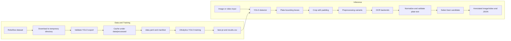
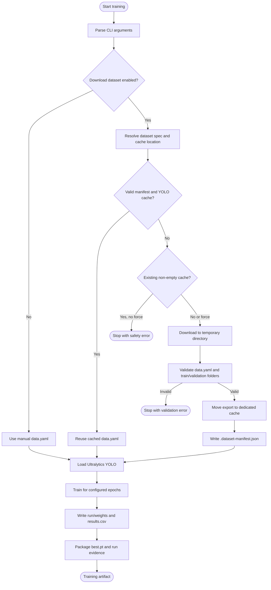
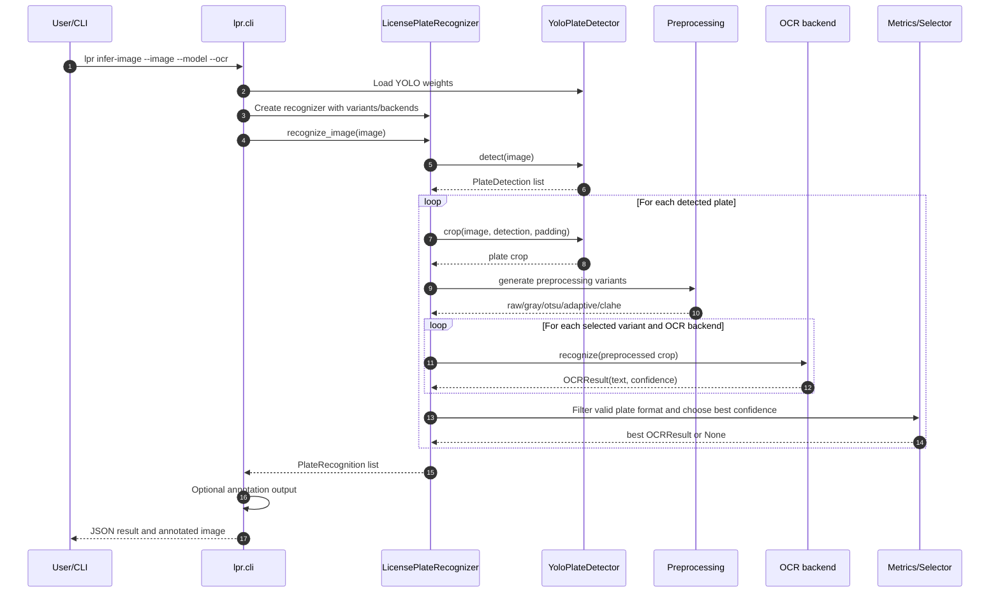
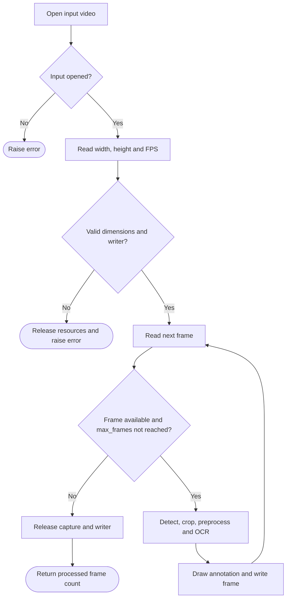
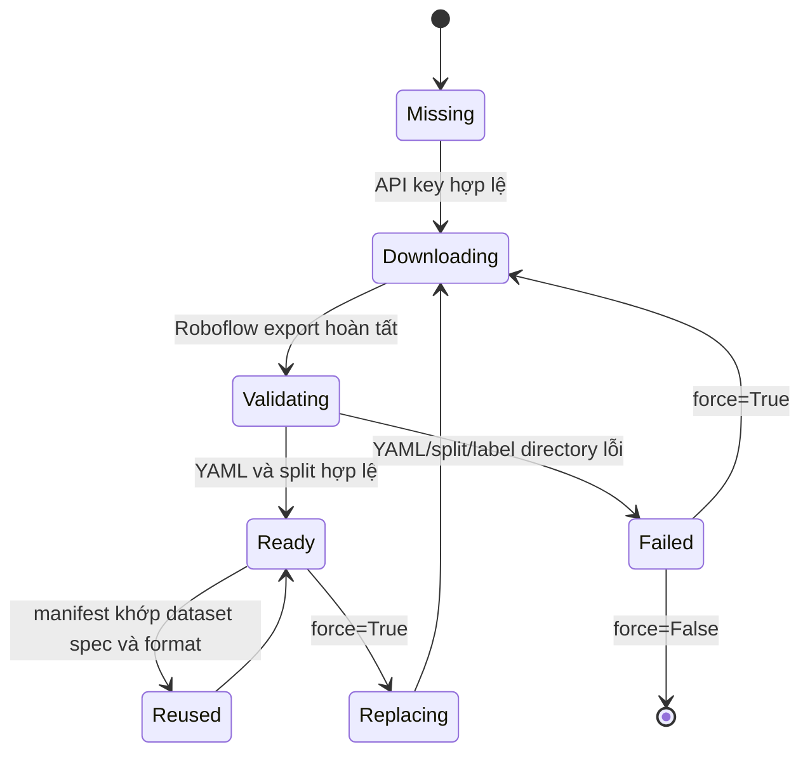

# HỆ THỐNG PHÁT HIỆN VÀ NHẬN DẠNG BIỂN SỐ XE VIỆT NAM

## Báo cáo học thuật cuối kỳ

> **Tên đề tài:** Xây dựng pipeline phát hiện và nhận dạng biển số xe Việt Nam từ ảnh và video bằng YOLO kết hợp OCR
> **Mã nguồn:** `CITD_ImageProcessing`
> **Trạng thái evidence:** Báo cáo được biên soạn từ source code, test suite, notebook và training artifact thực tế hiện có trong repository.

---

## Tóm tắt

Đề tài xây dựng một pipeline Automatic License Plate Recognition (ALPR) cho biển số xe Việt Nam từ ảnh và video. Hệ thống được thiết kế theo kiến trúc hai giai đoạn: giai đoạn thứ nhất sử dụng YOLO để phát hiện vùng biển số; giai đoạn thứ hai crop vùng phát hiện, áp dụng các biến thể tiền xử lý ảnh, sau đó sử dụng OCR để đọc chuỗi ký tự biển số. Pipeline hỗ trợ ba OCR backend gồm Tesseract, EasyOCR và PaddleOCR.

Dữ liệu detector được lấy từ phiên bản `cuong-ta-ulxex/vietnamese-car-license-plate/1` trên Roboflow và được tải động trong quá trình chuẩn bị dataset hoặc huấn luyện. Model detector sử dụng `yolo11s.pt`, huấn luyện 50 epoch với kích thước ảnh 640 và batch tự động. Training artifact thực tế ghi nhận validation precision `0,99447`, recall `0,99542`, mAP50 `0,99495` và mAP50-95 `0,72907` ở epoch 50.

Kết quả trên cho thấy detector có khả năng phát hiện tốt ở ngưỡng IoU 0,50. Tuy nhiên, mAP50-95 thấp hơn đáng kể, cho thấy cần đánh giá thêm độ chính xác localization ở các ngưỡng IoU chặt hơn. Các detector metrics này chưa thể được diễn giải thành OCR accuracy hoặc end-to-end ALPR accuracy vì repository hiện chưa có OCR ground truth, test split độc lập và benchmark video hoàn chỉnh.

**Từ khóa:** ALPR, license plate recognition, YOLO, OCR, Roboflow, image processing, Vietnamese vehicle plate.

---

## 1. Giới thiệu

### 1.1. Bối cảnh

Nhận dạng biển số xe là một bài toán thị giác máy tính có nhiều ứng dụng trong:

- kiểm soát ra vào bãi đỗ xe;
- giám sát giao thông;
- truy vết phương tiện;
- tự động hóa thu phí;
- quản lý phương tiện trong khuôn viên trường học hoặc doanh nghiệp.

Bài toán không chỉ yêu cầu xác định xe có xuất hiện trong ảnh hay không, mà phải thực hiện liên tiếp hai nhiệm vụ:

1. xác định đúng vị trí biển số trong ảnh;
2. đọc chính xác chuỗi ký tự trên biển số.

Đối với dữ liệu thực tế, chất lượng ảnh có thể bị ảnh hưởng bởi góc chụp, ánh sáng, chuyển động, blur, phản xạ, biển số một dòng hoặc hai dòng. Vì vậy, một hệ thống ALPR cần tách biệt detector và OCR để có thể kiểm soát, đánh giá và thay thế từng thành phần.

### 1.2. Phát biểu bài toán

Cho một ảnh hoặc một chuỗi frame video đầu vào, hệ thống cần trả về:

- bounding box của từng biển số được phát hiện;
- confidence của detector;
- chuỗi ký tự OCR sau chuẩn hóa;
- confidence của OCR;
- ảnh hoặc video đã được annotation;
- các metric đánh giá khi có ground-truth.

Pipeline không huấn luyện một OCR model riêng trong phạm vi hiện tại. OCR được triển khai dưới dạng các backend có thể thay thế, còn model được huấn luyện trực tiếp là YOLO license-plate detector.

### 1.3. Mục tiêu

#### Mục tiêu tổng quát

Xây dựng một pipeline có khả năng phát hiện và hỗ trợ nhận dạng biển số xe Việt Nam từ ảnh/video, có CLI, có quy trình chuẩn bị dataset, có training artifact và có cơ chế đánh giá OCR.

#### Mục tiêu cụ thể

- Xây dựng adapter cho YOLO detector.
- Chuẩn hóa bounding box và crop vùng biển số an toàn.
- Hỗ trợ crop padding và tiền xử lý ảnh.
- Hỗ trợ các preprocessing variants: `raw`, `gray`, `otsu`, `adaptive`, `clahe`.
- Tích hợp Tesseract, EasyOCR và PaddleOCR.
- Hỗ trợ inference ảnh và video.
- Tạo CLI để chạy inference và đánh giá OCR từ CSV.
- Tải và cache dataset Roboflow có kiểm soát.
- Huấn luyện YOLO bằng script và notebook Kaggle/Colab.
- Ghi nhận số liệu training có thể truy xuất từ artifact.
- Review chất lượng, reproducibility và các rủi ro của toàn bộ source.

### 1.4. Phạm vi

#### Trong phạm vi

- Detection một class: `plate`.
- Input ảnh và video.
- OCR trên crop biển số.
- Dataset YOLO export từ Roboflow.
- Training bằng Ultralytics YOLO.
- Đánh giá detector và OCR khi có dữ liệu ground-truth.
- Chạy local hoặc trên Kaggle/Colab thông qua notebook.

#### Ngoài phạm vi hiện tại

- Huấn luyện character-recognition model riêng.
- Tracking và temporal aggregation hoàn chỉnh cho video.
- Web service hoặc mobile application.
- Penetration test hoặc production security audit.
- Khẳng định end-to-end accuracy khi chưa có OCR/test evidence.

---

## 2. Tổng quan flow của dự án

Dự án có hai flow chính:

1. **Training flow:** chuẩn bị dataset → validate/cache → train YOLO → lưu weights và metrics.
2. **Inference flow:** nhận ảnh/video → detector → crop → preprocessing → OCR → chọn kết quả → annotation/metrics.

### 2.1. Sơ đồ kiến trúc tổng thể



### 2.2. Flow training chi tiết



#### Diễn giải từng bước

1. `scripts/train-yolo.py` đọc model, epochs, image size, batch, workers và device.
2. Theo mặc định, script gọi `ensure_roboflow_dataset()`.
3. Dataset cache được kiểm tra bằng manifest, dataset spec và model format.
4. Nếu cache hợp lệ, hệ thống tái sử dụng và không gọi API.
5. Nếu cache chưa tồn tại, Roboflow SDK tải export vào thư mục tạm.
6. Export được kiểm tra về cấu trúc YAML, train split, validation split, image directory và label directory.
7. Dataset hợp lệ được move vào `data/processed/license-plates`.
8. Manifest ghi dataset spec, format và đường dẫn tương đối đến `data.yaml`.
9. Ultralytics đọc `data.yaml` và thực hiện huấn luyện.
10. Run tạo ra `best.pt`, `last.pt`, `results.csv`, plots và validation previews.
11. `scripts/package-run.py` đóng gói run thành archive phục vụ tải xuống hoặc inference trên Kaggle.

### 2.3. Flow inference trên một ảnh



### 2.4. Flow inference trên video



Video inference hiện xử lý từng frame độc lập. `track_id` được lưu trong `PlateDetection` khi detector cung cấp, nhưng pipeline chưa dùng temporal voting hoặc track-level OCR aggregation để ổn định kết quả giữa nhiều frame.

### 2.5. Flow dữ liệu và cache



---

## 3. Nghiên cứu và lựa chọn dataset

### 3.1. Tiêu chí lựa chọn

Dataset được đánh giá theo các tiêu chí:

| Tiêu chí | Ý nghĩa |
|---|---|
| Phù hợp miền Việt Nam | Giảm domain mismatch về bố cục và kiểu biển số |
| Annotation detection | Phù hợp trực tiếp với YOLO detector |
| Kích thước và độ đa dạng | Tăng khả năng chịu blur, góc chụp và ánh sáng |
| Export format | Giảm rủi ro chuyển đổi dữ liệu |
| License/provenance | Cần thiết cho báo cáo và tái phân phối |
| Reproducibility | Dataset version và quy trình download phải truy lại được |

### 3.2. Dataset được lựa chọn

Dataset chính là **Vietnamese Car License Plate Dataset — Cuong Ta / Roboflow**, sử dụng runtime spec:

```text
cuong-ta-ulxex/vietnamese-car-license-plate/1
```

Lý do lựa chọn:

- phù hợp trực tiếp với bài toán plate detection;
- export YOLO tương thích với Ultralytics;
- có một class `plate`, khớp với cấu trúc detector;
- dataset version được chỉ định rõ trong source;
- không cần commit dữ liệu lớn vào Git.

Repository có ghi nhận metadata công khai của dataset ở mức khoảng 8.255 ảnh, nhưng con số này **không được dùng làm số liệu thực nghiệm cuối cùng**. Số lượng ảnh thực tế, số label hợp lệ và split count phải được đọc từ dataset export sau khi download và validation.

### 3.3. Các dataset được cân nhắc

- Kaggle Vietnam License Plate Segment Dataset: có polygon/corner annotation và phân loại one-line/two-line, nhưng license metadata được ghi là Unknown.
- Mì AI Vietnamese Plate Dataset: phù hợp về mặt ý tưởng cho detector và character recognition, nhưng provenance/license và số lượng chính thức chưa đủ rõ.

Chi tiết nghiên cứu nằm trong `docs/research-dataset-selection.md`.

---

## 4. Chuẩn bị và quản lý dữ liệu

### 4.1. YOLO data contract

Export cần có `data.yaml` và các thư mục train/validation:

```text
<cache>/
├── data.yaml
├── train/images/
├── train/labels/
├── valid/images/ hoặc val/images/
└── valid/labels/ hoặc val/labels/
```

Cấu hình manual fallback hiện có:

```yaml
path: data/processed/license-plates
train: images/train
val: images/val
test: images/test

names:
  0: license_plate
```

Dataset Roboflow runtime được normalize về đường dẫn `train/images` và `val/images` để tương thích với Ultralytics.

### 4.2. Cơ chế cache

Manifest hiện ghi:

- dataset spec;
- model format;
- đường dẫn tương đối tới `data.yaml`.

Cơ chế an toàn hiện có:

- API key đọc từ `ROBOFLOW_API_KEY`;
- download staged trong temporary directory;
- cache cũ không bị xóa nếu chưa có `--force`;
- forced replacement giới hạn trong child path của `data/processed`;
- dataset artifacts không commit vào Git.

### 4.3. Giới hạn validator hiện tại

Validator hiện mới kiểm tra hình dạng export và sự tồn tại của thư mục. Chưa có kiểm tra đầy đủ:

- image-label pairing;
- format từng dòng YOLO;
- class ID có nằm trong danh sách class hay không;
- tọa độ nằm trong khoảng `[0, 1]`;
- width/height dương;
- corrupt image;
- duplicate file/stem;
- label rỗng hoặc chứa giá trị không hữu hạn.

Đây là finding F-01 trong báo cáo review. Trước khi công bố kết quả học thuật, cần bổ sung semantic validation và ghi counts vào manifest.

---

## 5. Thiết kế detector

### 5.1. Detector contract

`src/lpr/detector.py` chuyển kết quả Ultralytics thành `PlateDetection`:

```text
PlateDetection(
    bbox=(x1, y1, x2, y2),
    confidence=float,
    class_id=int,
    track_id=int | None,
)
```

Các bước chuẩn hóa bounding box:

1. lấy `xyxy` từ Ultralytics;
2. bỏ box có số tọa độ không hữu hạn;
3. làm tròn outward bằng floor cho cạnh trái/trên và ceil cho cạnh phải/dưới;
4. clamp box vào kích thước ảnh;
5. bỏ box có width hoặc height không dương.

Thiết kế outward rounding nhằm tránh mất pixel biên khi crop biển số.

### 5.2. Model và training configuration

Training artifact ghi nhận:

| Tham số | Giá trị |
|---|---|
| Base model | `yolo11s.pt` |
| Task | Detection |
| Class | `plate` |
| Epochs | 50 |
| Image size | 640 |
| Batch | `-1` / auto |
| Workers | 2 |
| Seed | 0 |
| Deterministic | `true` |
| AMP | `true` |
| Optimizer | `auto` |
| Validation split | `val` |
| Device metadata | `auto` |

CLI hiện chưa expose seed, deterministic, project/name và toàn bộ training hyperparameters. Các giá trị này nên được ghi rõ trong metadata nếu cần tái lập nghiêm ngặt.

---

## 6. Tiền xử lý và OCR

### 6.1. Crop và resize

Sau detection, pipeline crop vùng bounding box với padding mặc định `0,08`. Crop được clamp vào ảnh và copy độc lập để tránh mutate input.

Ảnh crop được resize giữ nguyên aspect ratio:

- target height mặc định: 64 pixel;
- max width: 512 pixel;
- upscale dùng cubic interpolation;
- downscale dùng area interpolation.

### 6.2. Các preprocessing variants

| Variant | Mô tả |
|---|---|
| `raw` | Giữ ảnh màu sau resize |
| `gray` | Chuyển sang grayscale |
| `otsu` | Grayscale + Otsu threshold |
| `adaptive` | Adaptive Gaussian threshold |
| `clahe` | CLAHE + Otsu threshold |

Pipeline cho phép kết hợp nhiều variant và nhiều OCR backend để tạo nhiều candidate. Tuy nhiên, implementation hiện tại tạo toàn bộ 5 variants dù chỉ một subset được yêu cầu. Đây là finding F-02 và cần tối ưu trước khi benchmark video dài.

### 6.3. OCR backends

#### Tesseract

- sử dụng `image_to_data`;
- confidence được lấy từ token confidence;
- có whitelist ký tự `0-9A-Z`;
- page segmentation mode mặc định là 6;
- yêu cầu Tesseract binary có trong PATH.

#### EasyOCR

- nhận diện bằng `readtext`;
- hỗ trợ GPU tùy cấu hình;
- dùng allowlist ký tự biển số;
- các text box được sắp xếp theo vị trí ngang trước khi ghép chuỗi.

#### PaddleOCR

- dùng API `predict` hiện tại;
- adapter đọc `rec_texts` và `rec_scores`;
- hỗ trợ object result và dictionary result.

### 6.4. Chuẩn hóa và chọn candidate

OCR output được uppercase và loại bỏ ký tự ngoài:

```text
0123456789ABCDEFGHIJKLMNOPQRSTUVWXYZ
```

Một chuỗi được xem là hợp format khi khớp regex:

```text
^[0-9]{2}[A-Z]{1,2}[0-9]{4,6}$
```

Pipeline chỉ chọn candidate hợp format và có confidence cao nhất. Nếu không có candidate hợp lệ, kết quả OCR là `None`.

Cơ chế format filtering giúp giảm output rõ ràng sai định dạng, nhưng có rủi ro loại bỏ các biển số hợp lệ nằm ngoài regex hiện tại. Vì vậy, regex cần được kiểm chứng bằng tập ground-truth Việt Nam đa dạng trước khi dùng làm tiêu chí chính thức.

---

## 7. CLI và cách sử dụng

### 7.1. Inference ảnh

```bash
uv run lpr infer-image \
  --image path/to/image.jpg \
  --model models/best.pt \
  --ocr tesseract \
  --variants otsu,clahe \
  --output outputs/annotated.jpg
```

Output gồm JSON list các detection:

- bounding box;
- detection confidence;
- OCR text;
- OCR confidence;
- OCR backend;
- preprocessing variant được chọn.

### 7.2. Inference video

```bash
uv run lpr infer-video \
  --input path/to/input.mp4 \
  --output outputs/annotated.mp4 \
  --model models/best.pt \
  --ocr tesseract
```

Pipeline có các guard:

- input/output không được cùng path;
- kiểm tra video có mở được không;
- kiểm tra width/height;
- fallback FPS về 25 nếu metadata FPS không hợp lệ;
- kiểm tra VideoWriter;
- hỗ trợ giới hạn `--max-frames`;
- release capture và writer trong `finally`.

### 7.3. Đánh giá OCR từ CSV

CSV cần có hai cột:

```csv
ground_truth,prediction
29A-123.45,29A12345
51F12345,51F1234
```

Chạy:

```bash
uv run lpr evaluate-ocr --csv path/to/ocr.csv
```

Ground truth thiếu hoặc rỗng sẽ bị reject thay vì silently tính sai.

---

## 8. Phương pháp đánh giá

### 8.1. Detector metrics

Các detector metrics được lấy từ Ultralytics trên validation split.

#### Precision

$$
\text{Precision} = \frac{TP}{TP + FP}
$$

Đo tỷ lệ detection đúng trong tổng số detection được model dự đoán.

#### Recall

$$
\text{Recall} = \frac{TP}{TP + FN}
$$

Đo tỷ lệ ground-truth object được model phát hiện.

#### IoU

Intersection over Union giữa predicted bounding box và ground-truth box:

$$
IoU = \frac{|B_p \cap B_{gt}|}{|B_p \cup B_{gt}|}
$$

#### mAP50

Mean Average Precision tại IoU threshold 0,50.

#### mAP50-95

Mean Average Precision trung bình tại các IoU threshold từ 0,50 đến 0,95. Metric này nghiêm ngặt hơn và phản ánh tốt hơn chất lượng localization.

### 8.2. OCR metrics

#### Exact accuracy

$$
\text{Exact Accuracy} = \frac{\#\{prediction = ground\ truth\}}{N}
$$

#### Edit distance

Levenshtein distance là số phép thêm, xóa hoặc thay thế tối thiểu để biến prediction thành ground truth.

#### Character Error Rate

$$
CER = \frac{\text{Levenshtein distance}}{|ground\ truth|}
$$

#### Character accuracy

Implementation hiện tại tính:

$$
\text{Character Accuracy} = \max(0, 1 - CER)
$$

Các metric OCR chỉ có ý nghĩa khi CSV ground-truth đại diện đúng cho tập đánh giá và prediction được tạo từ cùng pipeline.

### 8.3. Quy trình đánh giá đề xuất

1. Download dataset version cố định.
2. Validate semantic labels và ghi counts.
3. Tách train/validation/test, không trộn ảnh tương đồng giữa các split.
4. Train detector với seed và hyperparameters được ghi rõ.
5. Đánh giá detector trên validation và test độc lập.
6. Sinh crop từ cùng một tập ảnh có ground-truth text.
7. Chạy từng OCR backend trên cùng crop set.
8. So sánh preprocessing variants.
9. Đo latency per crop và FPS video.
10. Phân tích lỗi theo góc chụp, blur, ánh sáng, biển một dòng/hai dòng.

---

## 9. Kết quả thực nghiệm hiện có

### 9.1. Kết quả kiểm tra phần mềm

| Kiểm tra | Kết quả |
|---|---|
| `uv run pytest` | 45 passed |
| Coverage | 74% trên 720 statements |
| `ruff check src tests scripts` | Passed |
| `python -m compileall -q src scripts` | Passed |
| `uv lock --check` | Passed |
| Notebook syntax compilation | 19/19 code cells passed |
| Training archive test | Passed |
| Ultralytics load `best.pt` | Passed |
| Secret pattern scan | Không phát hiện |
| Dependency audit | Không phát hiện known vulnerabilities |

### 9.2. Training result

Nguồn dữ liệu: `outputs/citd-yolo11s-training.zip:run/results.csv`.

| Epoch | Precision | Recall | mAP50 | mAP50-95 | Train box loss | Train cls loss | Train dfl loss |
|---:|---:|---:|---:|---:|---:|---:|---:|
| 1 | 0,88006 | 0,95203 | 0,94891 | 0,62567 | 1,26153 | 1,35033 | 1,14126 |
| 50 | 0,99447 | 0,99542 | 0,99495 | 0,72907 | 0,97004 | 0,34340 | 1,00403 |

Epoch 50 là row có mAP50-95 cao nhất trong file kết quả. Training time cuối cùng ghi nhận là `4728,94` giây.

### 9.3. Nhận xét kết quả

- Precision và recall đều xấp xỉ 0,995 trên validation.
- mAP50 gần 0,995 cho thấy detector nhận diện tốt khi IoU threshold là 0,50.
- mAP50-95 bằng 0,72907 thấp hơn đáng kể, cho thấy bounding box chưa ổn định ở các IoU nghiêm ngặt.
- Train classification loss giảm từ 1,35033 xuống 0,34340.
- Train box loss giảm từ 1,26153 xuống 0,97004.
- Chưa có đủ evidence để kết luận overfitting hoặc generalization trên test set vì chưa có test metrics độc lập trong artifact.

### 9.4. Các kết quả chưa có

Không được điền hoặc suy diễn các giá trị sau khi chưa chạy experiment tương ứng:

| Hạng mục | Trạng thái |
|---|---|
| Số ảnh train/validation/test thực tế | Chưa có trong artifact |
| Số label hợp lệ | Chưa có |
| Class distribution | Chưa có |
| Duplicate/corrupt count | Chưa có |
| Test mAP độc lập | Chưa có |
| OCR exact accuracy | Chưa có |
| OCR character accuracy | Chưa có |
| OCR CER | Chưa có |
| FPS video | Chưa có |
| End-to-end accuracy | Chưa có |
| So sánh OCR backend | Chưa có |

---

## 10. Review chất lượng source

### 10.1. Điểm mạnh

- Module boundaries rõ và dễ kiểm thử.
- Detector result được chuẩn hóa thành dataclass ổn định.
- Crop được clamp và copy, giảm nguy cơ mutate input.
- Video resources được release trong `finally`.
- Dataset download được staged trước khi replace cache.
- API key không được ghi vào manifest.
- CLI có validation cho nhiều tham số như variants, padding, frame limit.
- Metrics OCR có xử lý missing/empty ground truth rõ ràng.
- Test suite bao phủ tốt các pure utility và safety guard.

### 10.2. Vấn đề cần cải thiện

#### Mức High

- Validator chưa kiểm tra semantic nội dung label.
- Có thể chấp nhận label sai class hoặc tọa độ ngoài khoảng hợp lệ.

#### Mức Medium

- Tạo thừa preprocessing variants.
- Metadata chưa đủ reproducibility.
- `package_run()` có edge case self-inclusion.
- Hosted bootstrap dùng `--no-deps` và phụ thuộc môi trường có sẵn.
- Đồng thời tồn tại OpenCV headless và non-headless.

#### Mức Low

- CLI confidence validation chưa chặn ngay từ argparse.
- Một số tài liệu lịch sử từng stale; đã được cập nhật để trỏ tới evidence mới.

Chi tiết từng finding và evidence line-by-line nằm trong `docs/code-review-and-training-report.md`.

---

## 11. Security và reproducibility

### 11.1. Kết quả security scan

Trong phạm vi source/config/script/notebook:

- không phát hiện AWS/GitHub/Stripe/Slack/Google/Anthropic keys;
- không phát hiện private key hoặc JWT hardcoded;
- không phát hiện SQL injection, XSS sink, command injection, `eval` hoặc TLS verification disabled;
- không phát hiện `.env`, dataset, model, run hoặc output bị Git track;
- dependency audit không báo known vulnerabilities.

Đây là static scan, không phải penetration test. Model, dataset và media bên ngoài vẫn phải được xem là untrusted input.

### 11.2. Reproducibility hiện có

Đã có:

- Python version constraint `>=3.12,<3.13`;
- `uv.lock`;
- dataset spec cố định;
- model name, epoch, image size, batch và workers trong artifact;
- seed/deterministic trong `args.yaml`;
- `results.csv`;
- SHA-256 của `best.pt` trong package metadata.

Còn thiếu:

- Git commit SHA trong training metadata;
- dataset export checksum;
- số lượng file sau validation;
- package versions/runtime fingerprint;
- GPU/driver information;
- training command đầy đủ;
- test split và OCR evaluation artifact.

---

## 12. Hướng cải tiến

### Giai đoạn P0: bảo đảm validity của kết quả

1. Viết semantic YOLO label validator.
2. Kiểm tra image-label pairing theo stem.
3. Decode thử image và phát hiện file hỏng.
4. Ghi split counts, class distribution và duplicate rate.
5. Tách test split độc lập.
6. Sinh OCR ground-truth CSV.

### Giai đoạn P1: cải thiện hiệu năng và reproducibility

1. Chỉ sinh các preprocessing variants được yêu cầu.
2. Đo thời gian detector, OCR và tổng thời gian/frame.
3. Ghi Git SHA, dependency versions, GPU và dataset hash.
4. Chặn archive output nằm trong `run_dir`.
5. Chọn một OpenCV provider duy nhất.
6. Chạy smoke test trên Kaggle/Colab trước khi xử lý video dài.

### Giai đoạn P2: nâng chất lượng ALPR video

1. Dùng `track_id` để gom kết quả theo phương tiện.
2. Temporal voting cho chuỗi OCR giữa nhiều frame.
3. Confidence calibration cho detector và OCR.
4. Phân tích lỗi theo điều kiện ảnh.
5. Cân nhắc training OCR model chuyên biệt cho biển số Việt Nam.
6. Xây dựng benchmark cố định cho ảnh và video.

---

## 13. Kết luận

Đề tài đã triển khai được một pipeline có cấu trúc hoàn chỉnh ở mức detector-to-OCR: dataset được chuẩn bị động, model YOLO được huấn luyện, ảnh/video có thể được xử lý qua CLI, OCR backend có thể thay thế, và kết quả có thể được đánh giá bằng các metric tương ứng.

Training artifact xác nhận một model YOLO11s đã được train 50 epoch. Trên validation split, model đạt precision `0,99447`, recall `0,99542`, mAP50 `0,99495` và mAP50-95 `0,72907`. Kết quả này chứng minh detector có hiệu quả tốt tại IoU 0,50, nhưng chưa đủ để kết luận chất lượng localization nghiêm ngặt hoặc khả năng nhận dạng ký tự end-to-end.

Để hoàn thiện thành một kết quả học thuật đầy đủ, cần bổ sung semantic dataset validation, test metrics độc lập, OCR ground-truth evaluation, benchmark video và error analysis. Các số liệu chưa đo phải được ghi là chưa có, không được thay thế bằng ước lượng hoặc kết quả của thành phần khác.

---

## 14. Tài liệu và evidence tham chiếu

### Tài liệu trong repository

- [README dự án](../README.md)
- [Kiến trúc và implementation](architecture-and-implementation.md)
- [Dataset runtime integration](dataset-runtime-integration.md)
- [Research và dataset selection](research-dataset-selection.md)
- [Project journal](project-journal.md)
- [Code review và training report](code-review-and-training-report.md)
- [Training notebook](../notebooks/train_pipeline.ipynb)
- [Inference notebook](../notebooks/inference_pipeline.ipynb)

### Source owners

- `src/lpr/detector.py`
- `src/lpr/preprocessing.py`
- `src/lpr/ocr.py`
- `src/lpr/pipeline.py`
- `src/lpr/metrics.py`
- `src/lpr/dataset.py`
- `src/lpr/cli.py`
- `scripts/train-yolo.py`
- `scripts/prepare-dataset.py`
- `scripts/bootstrap-kaggle.py`
- `scripts/package-run.py`

### Training evidence

- `outputs/citd-yolo11s-training.zip:metadata.json`
- `outputs/citd-yolo11s-training.zip:run/args.yaml`
- `outputs/citd-yolo11s-training.zip:run/results.csv`
- `outputs/citd-yolo11s-training.zip:run/confusion_matrix.png`
- `outputs/citd-yolo11s-training.zip:run/results.png`
